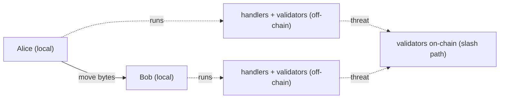
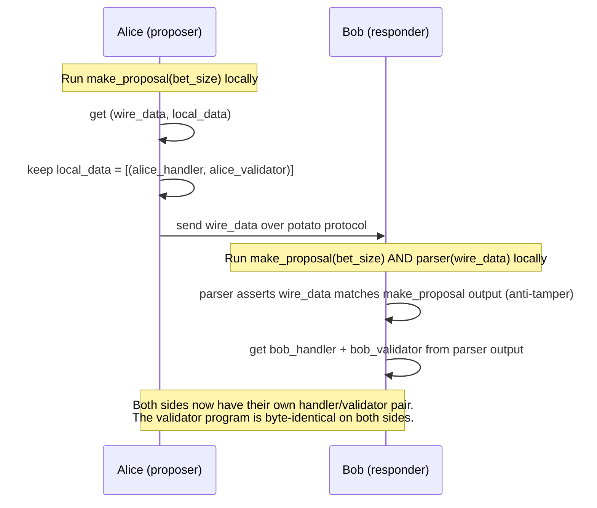
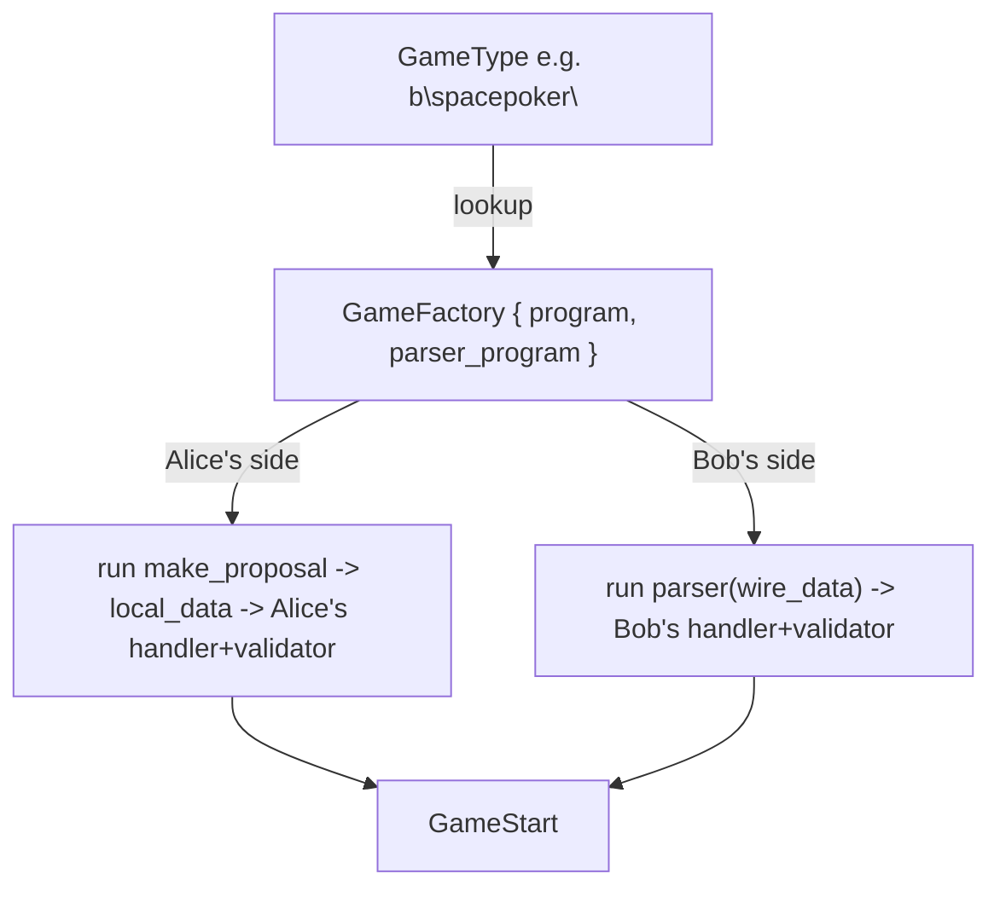
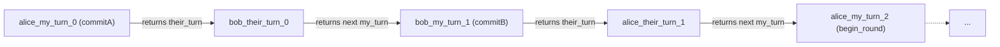
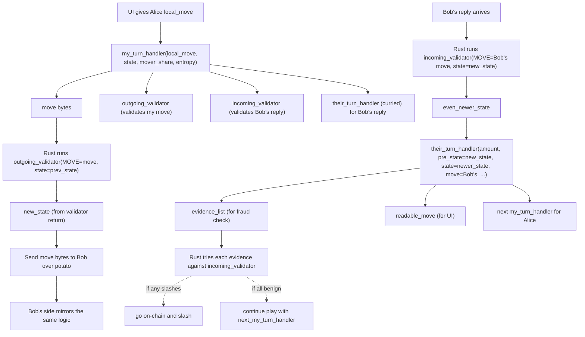

# Chialisp game files: how they work in the new format

This explains the **two-program** model that calpoker and spacepoker now use (and that krunk's scaffold matches): off-chain **handlers** drive UI/local play, on-chain **validators** enforce rules during disputes, and they meet in the middle through a small, well-defined data contract. Everything below references files you can open today; the canonical reference for the calling conventions themselves is [clsp/handler_api.md](clsp/handler_api.md), and the prose walk-through is [HANDLER_GUIDE.md](HANDLER_GUIDE.md).

## 1. What is a "game" in this system?

Two players have a Chia state channel open (see [OVERVIEW.md](OVERVIEW.md)) and want to play something. A game is a **turn-taking state machine** with these properties:

- Both sides agree on the same sequence of validator programs (one per move).
- Each move advances the state via a CLVM "validator" program that says "this move was legal; here is the new state".
- The vast majority of play happens **off-chain** — each side runs handlers locally and the players just exchange the move bytes.
- The on-chain validators are a *threat*: if either player tries to cheat off-chain, the other can drag the game on-chain and use the validator to slash.



## 2. The four kinds of file

Each game lives under `clsp/games/<name>/`. Take spacepoker as the canonical example:

```
clsp/games/spacepoker/
├── spacepoker_include.clsp          (1) entry-point module that the build compiles to .hex
├── spacepoker_generate.clinc        (2) off-chain library: make_proposal, parser, handlers
└── onchain/
    ├── commitA.clsp                 (3) on-chain validators, one per protocol step
    ├── commitB.clsp
    ├── begin_round.clsp
    ├── mid_round.clsp
    ├── end.clsp
    └── space_hand_eval.clinc        (4) helper .clinc, no .hex emitted, imported by validators
```

| # | Kind | File type | Compiled? | Purpose |
|---|------|-----------|-----------|---------|
| 1 | Entry point | `.clsp` | Yes → `.hex` per export | Names which library functions become top-level CLVM programs Rust can load |
| 2 | Library | `.clinc` | No (imported) | Off-chain logic: proposal factory, parser, handler functions |
| 3 | Validator | `.clsp` | Yes → `.hex` | On-chain rule enforcer for one protocol step |
| 4 | Helper | `.clinc` | No (imported) | Shared utilities (card derivation, hand evaluators, dictionary, etc.) |

The chialisp build (see [chialisp.toml](chialisp.toml) and `tools/build-chialisp.sh`) emits one `<file>_<export>.hex` per `(export NAME)` in a `.clsp` file. So `spacepoker_include.clsp` with two exports yields `spacepoker_include_spacepoker_make_proposal.hex` and `spacepoker_include_spacepoker_parser.hex`.

## 3. The two halves: handlers (off-chain) and validators (on-chain)

This is the single most important distinction in the new format.

| | Handler | Validator |
|---|---------|-----------|
| **When it runs** | Every turn during normal play, on each player's machine | Only on dispute (slash path); off-chain Rust also runs it to compute next state |
| **What it sees** | UI input, all curried-in secrets (preimages, salts, hash chains) | Just curried referee args + move bytes + previous state + evidence |
| **What it produces** | A move to send + the next pair of handlers/validators to use | A `(next_validator_hash next_state next_max_move_size …)` tuple or `0` for slash |
| **Crashing behaviour** | `(x …)` → Rust raises `ClvmErr`; `(error_tag msg)` → `GameMoveRejected` | `0` (nil) → slash succeeds; `(x …)` → slash attempt fails |

Handlers and validators are linked by **hashes**: every my-turn handler return commits to `(outgoing_validator_hash, incoming_validator_hash)`. These hashes appear in the referee curried args (`VALIDATION_INFO_HASH`, `PREVIOUS_VALIDATION_INFO_HASH`). Neither side can swap a validator out at runtime without the hash mismatching.

## 4. Game setup: the proposal/parser dance

When player A wants to start a game, both sides need to derive the **same** initial handler and validator. The trick: A doesn't send B the programs; instead, both sides compute them locally from the agreed game type and bet size. This means the wire format only carries small economic parameters, and there's no way for A to inject a tampered validator.

The flow:



In CLVM, `make_proposal` looks like (from [clsp/games/spacepoker/spacepoker_generate.clinc](clsp/games/spacepoker/spacepoker_generate.clinc)):

```scheme
(defun spacepoker_make_proposal (bet_size)
    (assign
        bet_unit (/ bet_size 10)
        (li
            (li                                ; <-- wire_data: sent to peer
                bet_size                       ; my_contribution
                bet_size                       ; their_contribution
                (li                            ; list of game_specs (usually 1)
                    (li (* 2 bet_size) 1 commitA_hash 0 32 bet_unit 0)
                ))
            (li                                ; <-- local_data: kept locally
                (li spacepoker_alice_commitA val_commitA)
            ))))
```

The inner game_spec is a fixed 7-tuple: `(amount we_go_first initial_validator_hash initial_move initial_max_move_size initial_state initial_mover_share)`.

The Rust side ([src/channel_handler/game.rs](src/channel_handler/game.rs)) destructures both halves via `Game::run_make_proposal` and `Game::run_parser`, then funnels into a `GameStart` describing the initial state.



The registry that maps `GameType` → `GameFactory` lives in `poker_collection` in [src/games/mod.rs](src/games/mod.rs).

## 5. The handler chain

Inside each game, two handler kinds alternate.

### My-turn handler

Called when it's *your* turn. The UI hands you a `local_move` (the player's input), and you decide:
- What move bytes to send.
- Which validator validates the move you just made (`outgoing_validator`).
- Which validator will validate the opponent's reply (`incoming_validator`).
- The mover_share if the opponent times out.
- Which their-turn handler should process the opponent's reply.

Signature and 10-element success return:

```
(curried_args... local_move amount state mover_share entropy)

→ (label
   move
   outgoing_validator outgoing_validator_hash
   incoming_validator incoming_validator_hash
   max_move_size
   mover_share
   their_turn_handler
   message_parser)   ; optional 10th element, may be omitted
```

A real example from spacepoker — Alice's first move (commit her hash-chain tip):

```scheme
(defun spacepoker_alice_commitA (local_move amount state mover_share entropy)
    (assign
        pre entropy
        chain (build_image_chain pre)
        image_5 (image_at chain 5)
        (list
            "spacepoker_alice_commitA"          ; label
            image_5                              ; move bytes
            val_commitA   commitA_hash           ; outgoing validator
            val_commitB   commitB_hash           ; incoming validator
            32                                   ; max_move_size for Bob's reply
            (/ amount 2)                         ; my mover_share if Bob times out
            (curry spacepoker_alice_handler_commitB chain) ; what handles Bob's commitB
        )))
```

### Their-turn handler

Called when the opponent just moved. You interpret their move for the UI and decide:
- What to display (`readable_move`).
- Any evidence the opponent's move was fraudulent (`evidence_list`).
- Which my-turn handler comes next (or nil if game over).
- Optionally, an out-of-band message to send back.

Signature and 3–4 element return:

```
(curried_args... amount pre_state state move validation_info_hash mover_share)

→ (readable_move
   evidence_list
   next_my_turn_handler   ; nil if game over
   message)               ; optional 4th element
```

The validator runs *before* the their-turn handler is called — the framework uses the validator's returned `new_state` as the their-turn handler's `state` argument, and the validator's pre-state as `pre_state`. So a their-turn handler gets to compare both sides of the transition; useful for fraud detection.

### How the chain forms



Each handler is a CLVM program. To "store" state between turns, handlers *curry* values into the next handler — `(curry spacepoker_alice_handler_commitB chain)` returns a new program with `chain` bound as its first parameter. The next time that handler runs, it'll receive the curried `chain` plus the standard arg list. This is how secrets like hash-chain preimages, salts, and seen-cards live across turns *without ever being transmitted*.

## 6. The validator chain (the on-chain side)

Each game's validators form a single linear chain. Spacepoker's chain:

```
commitA → commitB → begin_round → mid_round (raise loop) → begin_round (next street) → ... → end
```

A validator is an `(export (mod_hash …) body)` — an anonymous module. Importing it via `(import games.spacepoker.onchain.commitA exposing (program as val_commitA) (program_hash as commitA_hash))` gives you the program itself and its sha256tree hash.

### The validator's parameter shape

This is the part that confuses most people. The export header is **two argument groups**: the first is what the referee curries in; the second is what the runtime solution provides.

```scheme
(export (mod_hash                                         ; 1st group: curried by referee
    (MOVER_PUBKEY WAITER_PUBKEY TIMEOUT AMOUNT MOD_HASH NONCE
     MOVE MAX_MOVE_SIZE VALIDATION_INFO_HASH MOVER_SHARE PREVIOUS_VALIDATION_INFO_HASH)
                                                          ; 2nd group: from solution
    state previous_validation_program evidence output_conditions)

    <body>)
```

| Arg | Source | What it is |
|---|---|---|
| `mod_hash` | Curried | The referee's mod hash — used for hashing self-references |
| `MOVER_PUBKEY`, `WAITER_PUBKEY` | Curried | BLS pubkeys; nil off-chain, real on-chain (used to detect calling context) |
| `TIMEOUT`, `AMOUNT`, `MOD_HASH`, `NONCE` | Curried | Game-level constants |
| `MOVE` | Curried | The move being validated (bytes) |
| `MAX_MOVE_SIZE`, `VALIDATION_INFO_HASH`, `MOVER_SHARE`, `PREVIOUS_VALIDATION_INFO_HASH` | Curried | Per-move data the validator can cross-check |
| `state` | Solution | The state from the *previous* validator's return |
| `previous_validation_program` | Solution | The actual program of the previous validator (for slash chain hashing) |
| `evidence` | Solution | Slash evidence, or nil for normal play |
| `output_conditions` | Solution | Conditions to pass through to the referee on success |

### What a validator returns

This is the **constructive** part of the new format — validators don't just say yes/no, they say what comes next:

**Success (MAKE_MOVE):** a non-nil list

```scheme
(list next_validator_hash new_state next_max_move_size <optional label>)
```

**Slash:** nil, just `0`.

**Bug / impossible state:** `(x …)` raises. This makes the slash attempt fail with an exception (which has different semantics from a clean slash result).

A minimal real example — spacepoker's `commitA.clsp` body:

```scheme
(if_any_fail
    (= (strlen MOVE) 32)
    (= MOVER_SHARE (/ AMOUNT 2))
    0                                           ; slash if any predicate fails
    (list commitB_hash (list bet_unit MOVE) 32 "commitA"))   ; otherwise advance
```

Read this as: "If MOVE isn't 32 bytes, or mover_share isn't half the pot, slash. Otherwise, next validator is commitB, new state is `(bet_unit MOVE)`, next max_move_size is 32, label this 'commitA'."

### Why the constructive return matters

In the *old* format, validators only checked invariants and returned `0` or raised. The next validator's hash was supplied *as input* (via `new_validation_hash`) and the validator would check `(= new_validation_hash (sha256 next_hash (shatree next_state)))`. Off-chain, the Rust code had to know the state transition rules to compute `new_state` itself.

In the new format, the validator **is** the state-transition function. Rust just runs it and reads element 1 of the return for `new_state`. This:

- Removes duplicated transition logic between Rust and CLVM.
- Eliminates an entire class of bugs (Rust and CLVM disagreeing about the new state).
- Makes validators self-describing — you can read one and know exactly what the next state is.

### On-chain vs off-chain calls of the same validator

The same `.clsp` file runs both:

- **On-chain (slash path):** Referee curries real `MOVER_PUBKEY`/`WAITER_PUBKEY` and runs with submitted evidence. If validator returns nil, the referee emits a payout coin giving the full pot to the slasher.
- **Off-chain (every honest move):** Rust calls it with nil pubkeys to compute the new state. Same validator, different curried context.

Some validators use this to differentiate behaviour. Spacepoker's `end.clsp` checks `WAITER_PUBKEY` to know if it's on-chain — if so, it requires real evidence; if not, it accepts the move:

```scheme
(if (not evidence)
    (if WAITER_PUBKEY
        (x "on-chain requires evidence")
        (list 0 0 0 "end"))                      ; off-chain accept
    ...real slash check using evidence...)
```

This pattern is the new format's idiomatic way to distinguish "validator is being called for normal play" vs "validator is being called for an actual slash attempt".

## 7. End-to-end data flow for a single turn

The clearest way to see how all the pieces compose. Suppose it's Alice's turn:



A few key invariants this enforces:

- **`outgoing_validator_hash` from move N must equal `incoming_validator_hash` from move N−1.** The opposing side's previous handler already committed to which validator will validate your next move. If you swap it, the on-chain referee will catch the mismatch via `VALIDATION_INFO_HASH`/`PREVIOUS_VALIDATION_INFO_HASH`.
- **`new_state` is single-sourced from the validator.** Both Rust and the handler use the validator's output as the canonical state. Off-chain handlers never compute the new state themselves.
- **Evidence is auto-tested.** The handler just lists candidates; the framework runs each one through the validator and picks the first that returns `0` (slash). Honest play looks identical to evidence-included-but-no-slash play.

## 8. The Rust glue

The chialisp side never talks to the wire directly. Rust orchestrates everything via [src/channel_handler/game.rs](src/channel_handler/game.rs):

| Rust step | Calls into chialisp |
|---|---|
| Game proposal | `make_proposal(bet_size)` — gets wire_data + local handler/validator pair |
| Game acceptance (responder) | `parser(wire_data)` — derives their own handler/validator |
| Each my-turn | `my_turn_handler(...)` — gets move bytes + next pair |
| Move validation | `outgoing_validator(...)` — verifies our move; `incoming_validator(...)` — verifies their move |
| Each their-turn | `their_turn_handler(...)` — gets readable_move + evidence candidates |
| Fraud check | For each evidence: run the validator again with that evidence as solution arg |

Rust never has to know what a particular game does — calpoker, spacepoker, krunk all expose the same trait surface (`make_proposal` + `parser`), and the rest is data flowing through the chialisp programs the trait returns.

## 9. Putting it together: how to read any game

When you open a game directory like `clsp/games/<name>/`:

1. **Start with `<name>_include.clsp`** — this tells you what top-level CLVM programs Rust loads. In the new format, expect two: `<name>_make_proposal` and `<name>_parser`.
2. **Read `<name>_generate.clinc`** — this is the brain of the off-chain side. Find `<name>_make_proposal` to learn the initial state and first handler; trace each handler's return to see which handler comes next.
3. **Cross-reference with `onchain/*.clsp`** — when a handler returns `outgoing_validator = val_foo`, open `foo.clsp` to see what move-shape it expects and what state transition it implements. The body's return tuple is the next state.
4. **The shared shape across all games:**
   - Validators always use the 11-element UPPERCASE curried-args header.
   - My-turn handlers always end with `(curry next_their_turn ...curried-secrets)` or just `next_their_turn` symbol.
   - Their-turn handlers always return at least `(readable_move evidence_list next_my_turn_handler)`.
   - All inter-validator links are by hash, computed once during compilation and referenced by name (`commitB_hash`, `begin_hash`, etc.).

## 10. Why the new format is the way it is

Six design pressures shaped it; useful to keep in mind when extending:

1. **No peer-supplied programs.** Both sides derive their handlers and validators from a *registered factory* invoked locally. The wire only carries economic parameters and the small game_spec tuple. The parser's `(assert (deep= args (f (make_proposal bet_size))) …)` is the anti-tamper check.
2. **Validators are the source of truth for state transitions.** Off-chain Rust doesn't duplicate state-transition logic; it just reads the validator's return.
3. **Validators are single programs that run in two contexts.** A `WAITER_PUBKEY` curried check lets a validator behave differently on-chain (require evidence) vs off-chain (accept).
4. **Slashing is constructive evidence search.** The their-turn handler proposes evidence candidates; the framework tests each by running the validator. Nil-evidence is always tried first by the framework, so handlers don't need to include it.
5. **Hash chains, not in-band hashes.** Every move commits to the next validator's hash; the referee enforces it via `PREVIOUS_VALIDATION_INFO_HASH`/`VALIDATION_INFO_HASH`. You can't retroactively change which program will validate the opponent's reply.
6. **Currying carries secrets across turns.** Salts, preimages, hash chains, seen-cards — none of these go over the wire. They're curried into the next handler the local side will run.

That's the whole architecture. If you want a deeper dive on any individual piece — the calling conventions in microscopic detail, the referee puzzle, the slash path on-chain, or the off-chain Rust state machine — those are in [clsp/handler_api.md](clsp/handler_api.md), [ON_CHAIN.md](ON_CHAIN.md), and [HANDLER_GUIDE.md](HANDLER_GUIDE.md) respectively.
