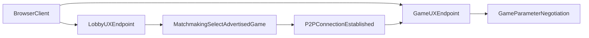

# Gaming Client UX Design

This document describes the browser UX model for the player client:

- how it works now,
- how it should work in the target model,
- and the boundary between lobby responsibilities and game responsibilities.

The goal is to support independent evolution of lobby UX and game UX without
breaking matchmaking or game startup flows.

## Scope and Audience

This document is intended for frontend, backend, and product contributors
working on player-facing browser UX and service integration boundaries.

It focuses on UX flow and service boundaries, not low-level implementation
details.

## Current UX Model (Now)

Today, lobby and game UX are presented in the same browser frame.

### Characteristics

- A single UX surface handles both lobby interactions and in-game interactions.
- Lobby and game presentation are tightly coupled in the same rendering context.
- UX changes in either area are more likely to require coordinated releases.

### Constraints

- Lobby feature work and game feature work can block each other.
- UX regressions in one area can affect the full player flow.
- Iteration speed is limited by shared deployment and shared UI coupling.

## Future UX Model (Target)

The target UX separates lobby and game surfaces while keeping the user flow
coherent.

### Target Behavior

- Lobby view is always visible, or easily viewable through a UX switch.
- Lobby UX HTML/CSS is served from a different endpoint than game UX HTML/CSS.
- Game UX remains focused on active game setup and play.

### Why This Matters

Separating endpoints and UX surfaces enables independent release cadence:

- Lobby service can rev lobby features and layout without waiting on game UX.
- Game UX can rev game-specific behavior without requiring lobby changes.
- Ownership boundaries are clearer across teams and services.

## Responsibility Split: Lobby UX vs Game UX

### Lobby UX Responsibilities

- Show advertised games and related metadata needed for user selection.
- Support matchmaking by allowing a player to select a previously advertised
  game.
- Drive the pre-connection user journey up to peer connection establishment.

### Game UX Responsibilities

- Start after both parties are connected through the peer-to-peer message
  protocol.
- Handle game parameter negotiation between peers.
- Continue with game-specific UX once parameters are agreed.

### Boundary Contract

The handoff boundary is:

1. Lobby selects a game advertisement.
2. Peer-to-peer connection is established.
3. Game UX takes over parameter negotiation and game flow.

Lobby should not own game parameter negotiation logic. Game UX should not own
matchmaking selection logic.

## User Flow Comparison

### Now

1. Player enters unified browser frame.
2. Player navigates lobby and game start flow in the same surface.
3. Matchmaking and game negotiation happen in a tightly coupled UX context.

### Future

1. Player enters lobby UX (or can switch to it quickly at any time).
2. Player selects a previously advertised game in lobby UX.
3. System establishes peer-to-peer connection.
4. Game UX takes control for game parameter negotiation.
5. Game UX continues into active gameplay.

## Browser UX and Service Flow

## Architecture and Deployment Implications

- Lobby UX and game UX should have independent release pipelines.
- Each endpoint should be versionable without forcing lockstep deploys.
- Integration points should be explicit and minimal (selected game + connection
  readiness + handoff metadata).
- Backward compatibility for handoff data should be maintained during rollout.

## Migration Notes

The migration should preserve player continuity while moving from unified UX to
split UX.

### Transitional Behavior

- Existing unified flow may remain available during rollout.
- New split flow should be introduced behind clear routing or feature gating.
- Handoff behavior should be observable and testable in both paths.

### Completion Criteria

The migration is complete when:

- Lobby and game UX are served from separate endpoints in production.
- Lobby view is persistently visible or reachable via a simple UX switch.
- Matchmaking selection occurs in lobby UX.
- Game parameter negotiation occurs in game UX after peer connection.
- Teams can ship lobby and game UX updates independently.

