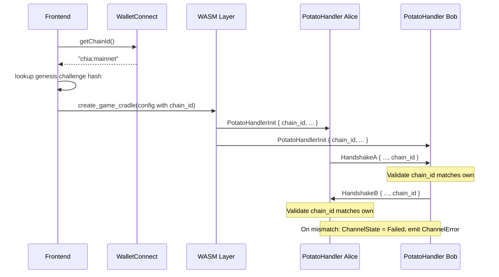

# Handshake Protocol

The handshake is a multi-message protocol that establishes a state channel
between two peers (Alice and Bob). It exchanges public keys, creates the
channel funding transaction, and validates that both peers are on the same
Chia network before committing funds.

For the broader architecture (state channels, potato protocol, dispute
resolution), see `ARCHITECTURE.MD`.

## Message Flow

| # | Direction   | Message type | Payload |
|---|-------------|--------------|---------|
| 1 | Alice -> Bob | HandshakeA   | Alice's `HandshakeB` keys + `parent` (launcher coin) |
| 2 | Bob -> Alice | HandshakeB   | Bob's public keys, reward puzzle hash, reward payout signature, chain_id |
| 3 | (internal)  | Batch        | Empty potato (Bob sends initial state-0 signatures) |
| 4 | (internal)  | Batch        | Alice sends state-0 signatures |
| 5 | Alice -> Bob | HandshakeE   | Alice's partial `SpendBundle` (wallet spend + launcher spend) |
| 6 | Bob -> Alice | HandshakeF   | Final combined `SpendBundle` |

Messages 1 and 2 each carry a `HandshakeB` struct containing:

- `channel_public_key` -- half of the 2-of-2 channel coin key
- `unroll_public_key` -- half of the 2-of-2 unroll coin key
- `referee_pubkey` -- key for referee coin signing
- `reward_puzzle_hash` -- where to send rewards on channel closure
- `reward_payout_signature` -- proof of reward puzzle hash ownership
- `chain_id` -- genesis challenge hash identifying the network (see below)

## Chain ID Validation

Each peer includes its `chain_id` in the first handshake message it sends
(HandshakeA for Alice, HandshakeB for Bob). The `chain_id` is the 32-byte
genesis challenge hash that uniquely identifies the Chia network (mainnet,
testnet, etc.).

When a peer receives the other side's first message, it compares the
received `chain_id` against its own. If they differ, the handshake fails
immediately:

1. The `ChannelState` transitions to `Failed`.
2. A `ChannelError` notification is emitted with a descriptive reason
   (e.g., `"Network mismatch: our chain_id is <hex> but peer sent <hex>"`).
3. The UI displays the error as a destructive toast.
4. No further handshake messages are sent or processed.

This prevents two peers on different networks from establishing a channel
that would fail with cryptographic errors later.

### Data Flow

### Origin of chain_id

- **Frontend (real wallet):** The WalletConnect session exposes a chain
  identifier such as `"chia:mainnet"` or `"chia:testnet10"`. The frontend
  maps this to the corresponding genesis challenge hash using a lookup
  table and passes it as `agg_sig_me_additional_data` in the WASM game
  cradle config.

- **Simulator tests:** Tests use the hardcoded `AGG_SIG_ME_ADDITIONAL_DATA`
  constant from `src/common/constants.rs` (the mainnet genesis challenge).

## Known Genesis Challenge Hashes

| Network    | Genesis Challenge (hex) |
|------------|------------------------|
| mainnet    | `ccd5bb71183532bff220ba46c268991a3ff07eb358e8255a65c30a2dce0e5fbb` |
| testnet10  | `ae83525ba8d1dd3f09b277de18ca3e43fc0af20d20c4b3e92ef2a48bd291ccb2` |

## Key Code

- **Handshake types:** `src/potato_handler/handshake.rs` (`HandshakeB`,
  `HandshakeA`, `ChannelState`)
- **Handshake state machine:** `src/potato_handler/mod.rs`
  (`process_incoming_message`, `start`)
- **Notification types:** `src/potato_handler/effects.rs`
  (`GameNotification::ChannelError`)
- **WASM config:** `wasm/src/mod.rs` (`JsGameCradleConfig`,
  `GameConfigPartial`)
- **Frontend config:** `resources/gaming-fe/src/constants/env.ts`
  (`GENESIS_CHALLENGES`)
- **Frontend cradle creation:** `resources/gaming-fe/src/hooks/WasmStateInit.ts`
  (`createGame`)
